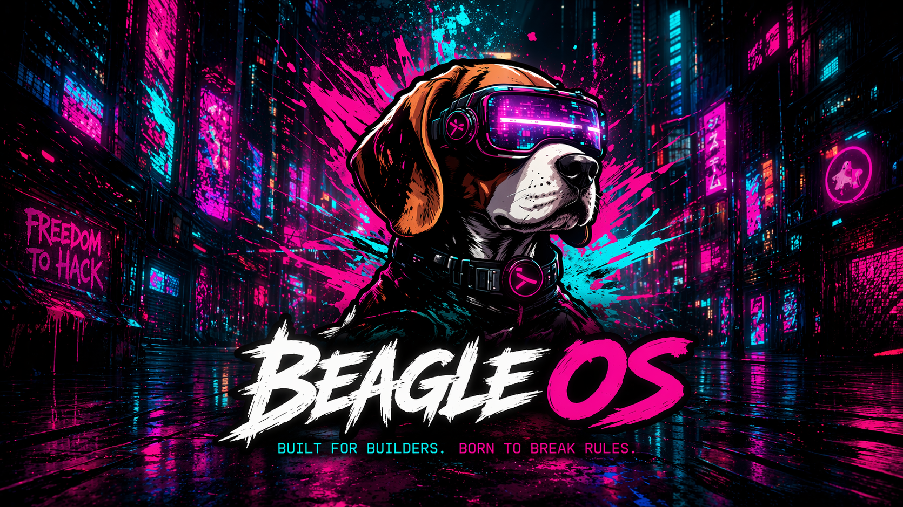

[](docs/assets/beagle_splash.png)

[](docs/assets/beagle_logo.png)

# Beagle OS

> **Built to boot. If it still won't boot, the BIOS is being dramatic.**

> **Open-source hypervisor OS, endpoint runtime, and gaming kiosk — batteries included, Beagle host optional.**

[](LICENSE)
[Download Latest](https://beagle-os.com/download/)
[]()
[]()

Beagle OS is a source-available, standalone virtualization platform. Free for private use — commercial use requires a license (see [LICENSE](LICENSE) or visit [beagle-os.com](https://beagle-os.com)). It runs its own compute, storage, and network stack on bare metal and delivers streamed desktops and gaming sessions to thin clients — no Beagle host required.

### Three modes, one ISO

- `Beagle OS Desktop`
  Endpoint runtime. Runs Beagle Stream Client and connects to a Beagle Stream Server-enabled VM hosted by any Beagle server.
- `Beagle OS Gaming`
  Gaming kiosk shell. Launches GeForce NOW and returns to the kiosk on exit.
- `Beagle OS Server`
  Boots a bare server and installs the full Beagle hypervisor stack. During installation you choose:
  - **Beagle OS Standalone** — Beagle's own virtualization runtime, no third-party hypervisor needed.
  - **Beagle OS with Beagle host** — installs Beagle host as an optional provider underneath Beagle.

Beagle OS is not a Beagle host wrapper. It is a focused, self-contained platform for streamed desktops, gaming endpoints, and reproducible fleet management. Beagle host can be selected as a provider if you already operate it, but it is entirely optional.

## What Lives in This Repository

- `beagle-host/`
  Host-side control plane, download publication, and installer rendering.
- `beagle-ui/`
  Beagle host UI integration and Beagle Fleet controls.
- `core/`
  Provider-neutral contracts and shared services for virtualization and platform behavior.
- `providers/`
  Concrete backend/provider implementations, currently starting with Beagle host.
- `thin-client-assistant/`
  Endpoint runtime, live-build inputs, USB installers, and endpoint installer logic.
- `beagle-kiosk/`
  Open-source Electron source tree for the gaming kiosk.
- `scripts/`
  Build, packaging, publication, deployment, and validation utilities.

## Gaming Kiosk

The gaming kiosk is now part of the public repository.

Key points:

- Source lives in [`beagle-kiosk/`](beagle-kiosk/README.md)
- Built as an Electron AppImage for release distribution
- Supports `Meine Bibliothek` and `Spielekatalog`
- Launches GeForce NOW as a child process
- Uses direct store links without affiliate parameters
- Ships daily and manual catalog refresh support

## Quick Start

### Install Beagle on an Existing Host

```bash
git clone https://github.com/meinzeug/beagle-os.git
cd beagle-os
./scripts/setup-beagle-host.sh
./scripts/check-beagle-host.sh
```

After setup, the current provider host gets:

- the Beagle control plane
- hosted installer and update artifacts
- the Beagle Fleet button in the UI
- per-VM USB installer rendering

### Install a New Host with the Server Installer ISO

1. Download the current server installer ISO from `beagle-os.com`.
2. Boot the target machine from the ISO.
3. Enter the server hostname, Linux username, password, and target disk.
4. The installer installs Debian Bookworm, installs the current host provider stack, downloads Beagle from GitHub, and runs the Beagle host setup.

### Install an Endpoint

You can use:

- the public installer ISO
- the public USB helper scripts
- or the preferred VM-specific USB installer exposed by the Beagle host

## Architecture

Beagle OS is a layered platform with provider-neutral contracts at the core:

1. `Beagle Virtualization Runtime`
   Beagle's own compute, storage, and network stack. Manages VMs, disks, and bridges natively on bare metal.
2. `Provider Layer` *(optional)*
   Concrete external hypervisor integration. Currently supports Beagle host as an optional provider. More providers can be added without changing core logic.
3. `Beagle OS Endpoint Runtime`
   Dedicated endpoint OS for Beagle Stream Client desktop mode and Gaming kiosk mode.
4. `Beagle Control Plane`
   Inventory, VM-aware artifact publication, host services, health checks, and fleet management.
5. `Beagle Server Installer`
   Bootable bare-metal installer with two modes: **Standalone** (Beagle only) and **with Beagle host** (Beagle host as optional provider).

In practice:

- Beagle OS is the primary operator surface — not Beagle host.
- Beagle Stream Server inside a VM is the desktop streaming target.
- Beagle Stream Client on the endpoint is the desktop client.
- The Beagle kiosk is the gaming shell around GeForce NOW.
- Public artifacts on `beagle-os.com` are the canonical release surface.

## Operational Model

Typical Desktop flow:

1. Boot a server with the Beagle Server Installer ISO.
2. Choose **Beagle OS Standalone** (or **with Beagle host** if desired).
3. Create a Beagle Stream Server-capable VM via the Beagle Console.
4. Download the VM-specific endpoint installer from the Beagle Console.
5. Write a USB stick and install the endpoint.
6. Boot the endpoint into `Beagle OS Desktop` — the stream starts automatically.

Typical Gaming flow:

1. Boot the endpoint into `Beagle OS Gaming`.
2. The kiosk starts as the primary shell.
3. Launch GeForce NOW from the kiosk.
4. When GFN exits, the kiosk returns.

Typical Host bootstrap flow:

1. Boot the Beagle Server Installer ISO on bare metal.
2. Select the install disk and set hostname/user/password.
3. Choose installation mode:
   - **Beagle OS Standalone** — installs Debian + Beagle virtualization runtime only.
   - **Beagle OS with Beagle host** — additionally installs Beagle host as an optional provider.
4. After install, log into the Beagle Console and manage your fleet from there.

## Public Artifacts

The public update surface on `https://beagle-os.com/beagle-updates/` publishes:

- `beagle-downloads-status.json`
- `SHA256SUMS`
- `beagle-os-installer-amd64.iso`
- `beagle-os-server-installer-amd64.iso`
- `Debian-1201-bookworm-amd64-beagle-server.tar.gz`
- `pve-thin-client-usb-payload-latest.tar.gz`
- `pve-thin-client-usb-bootstrap-latest.tar.gz`
- USB helper scripts
- kiosk release metadata and kiosk AppImage artifacts

## Build and Release

Heavy builds must run on a dedicated release build host, not on this local workstation.

Common release steps:

```bash
./scripts/validate-project.sh
./scripts/package.sh
./scripts/publish-public-update-artifacts.sh
./scripts/create-github-release.sh
```

## License

This repository is licensed under the [Beagle OS Source Available License](LICENSE).

- **Private use** is free of charge.
- **Commercial use** requires a separate license — request one at [beagle-os.com](https://beagle-os.com).
