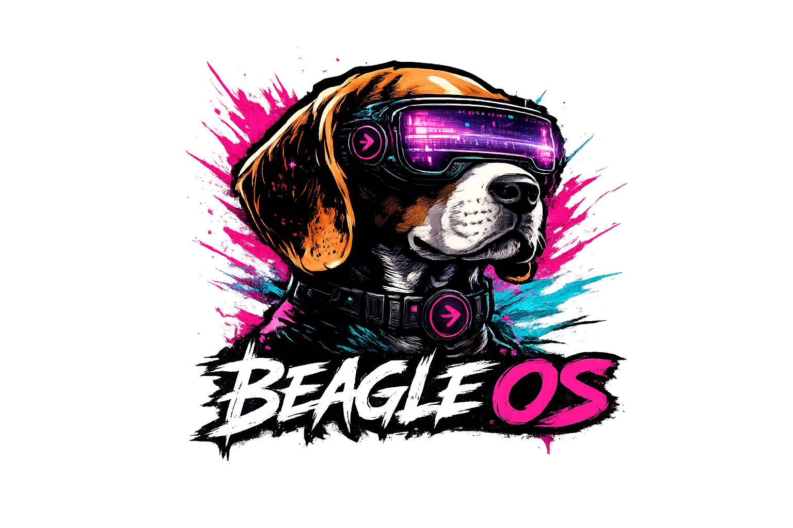
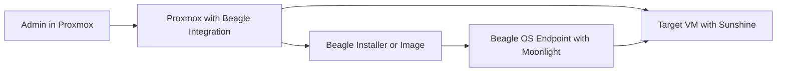

[](docs/assets/beagleos.png)

# Beagle OS

> **Proxmox-native endpoint OS and management stack for streaming virtual desktops.**

[](LICENSE)
[](https://github.com/meinzeug/beagle-os/releases)
[]()
[]()

> **License:** Free for private/non-commercial use. Commercial use only via the official [beagle-os.com](https://beagle-os.com) SaaS offering. See [LICENSE](LICENSE) for details.

---

## What is Beagle OS?

Beagle OS is an intentionally narrow-focused project. There is exactly one product path:

- `Sunshine` running inside the target VM
- `Moonlight` running on Beagle OS
- `Proxmox` as the inventory, provisioning, and operations surface

Beagle OS is **not** a multi-protocol remote desktop toolkit. It is a managed endpoint solution built around a single, well-defined streaming stack.

## Requirements

- Proxmox VE 7.x or 8.x
- A target VM with [Sunshine](https://github.com/LizardByte/Sunshine) installed
- Thin clients, mini PCs, or USB media for the Beagle OS endpoint

---

## Architecture in One Sentence

Beagle OS turns Proxmox into a management surface for Moonlight/Sunshine endpoints and ships a dedicated endpoint OS to run on them.

## Typical Flow


---

## Product Concept

Beagle OS consists of two interconnected layers:

1. **Beagle Control Plane on Proxmox**
2. **Beagle OS as a Thin-Client Operating System**

The Control Plane attaches directly to Proxmox and turns VMs into manageable streaming targets. The OS boots on thin clients, mini PCs, or USB media and launches Moonlight directly against the assigned VM.

The result is not a classic "remote desktop toolkit" but a managed endpoint solution:

- VM-specific installers served directly from Proxmox
- Resolved VM profiles visible directly in the Proxmox UI
- Preconfigured streaming targets per VM
- Reproducible client images
- Dedicated thin-client endpoints instead of general-purpose Linux desktops
- Operational model for fleets of clients with a uniform target image
- Device diagnostics and support bundles built into the endpoint OS
- Preparable Moonlight client identities for reproducible Sunshine pairing
- Secure USB device passthrough from the thin client to its assigned VM

---

## Target Vision

Beagle OS is designed as an open endpoint and management platform for virtual workstations:

- Not Citrix- or VMware-centric
- Not reliant on generic broker stacks
- Directly coupled to Proxmox
- Optimized for Moonlight/Sunshine streaming
- Built for fixed, controlled endpoints

In short:

- `Open endpoint management model`
- `Proxmox-native orchestration`
- `Moonlight/Sunshine as the sole streaming stack`

---

## Quick Start

### Setup on an Existing Proxmox Host

1. Clone the repository onto the host or an admin machine
2. Run the setup script:
```bash
./scripts/setup-proxmox-host.sh
```

The setup script completes the standard path in a single step:

- Installs Beagle to `/opt/beagle`
- Sets up the Control Plane, timers, and services on the Proxmox host
- Integrates the Proxmox UI extension
- Prepares hosted download artifacts
- Runs a host health check immediately after

Optional environment variables:
```bash
INSTALL_DIR=/opt/beagle \
PVE_DCV_PROXY_SERVER_NAME=srv.example.net \
PVE_DCV_PROXY_LISTEN_PORT=8443 \
BEAGLE_SITE_PORT=443 \
./scripts/setup-proxmox-host.sh
```

After a successful setup, a **Create Beagle VM** button will appear next to **Create VM** in the Proxmox UI. Use it to provision an Ubuntu Desktop VM with Beagle/Sunshine presets. From there, the Beagle profile for that VM — including live-USB and USB installer downloads for Linux and Windows — is immediately accessible.

The Beagle Fleet modal is also the operator surface for managed desktop profiles:

- Create a Beagle desktop VM with a selectable desktop environment such as `XFCE`, `GNOME`, `KDE Plasma`, `MATE`, or `LXQt`
- Set locale and keyboard layout up front
- Add common software presets and extra APT packages during provisioning
- Re-open an existing managed Beagle desktop VM later and change desktop, locale, keyboard layout, and packages in place

---

## Operational Model

The operational workflow is intentionally simple:

1. Install the Beagle integration on the Proxmox host.
2. Prepare a VM as a Sunshine stream target.
3. Bind the target parameters to the VM in Proxmox.
4. Roll out a Beagle OS installer or image.
5. Boot the client — it streams directly against its assigned VM.

### Preferred Operator Path per VM

1. Select the target VM in Proxmox.
2. Download the VM-specific **USB Installer Script**.
3. The script fetches the current Beagle Installer ISO from the Proxmox host.
4. The script writes a bootable USB drive from it.
5. The VM profile is embedded directly into the stick.
6. After installation, Beagle OS boots with Moonlight autostart against exactly this VM.

This makes Proxmox not just a compute platform, but simultaneously:

- Inventory for streaming VMs
- Delivery point for client installers
- Source for VM-specific presets
- Central integration point for Beagle OS

---

## Main Components

### 1. Beagle Control Plane on Proxmox

The host side delivers the management functions:

- Integration into the Proxmox UI
- Beagle Fleet create/edit workflows for managed desktop VMs
- Beagle profile dialogs with export, download, and health actions per VM
- Desktop catalog and software-preset catalog for Beagle desktop provisioning
- VM-specific artifact generation
- Download endpoints for installers and images
- VM-specific USB scripts that fetch the installer ISO and write it to USB with an embedded target profile
- Local Control Plane API for health and inventory
- USB Control Plane for export, attach, detach, and guest state per VM
- Reapply/refresh mechanisms after host changes
- Residential egress policies for sensitive web targets
- Stable endpoint identity with hostname, locale, and timezone control
- Product website served directly from the Beagle host via HTTPS/443

Core product logic:

- A VM is described as a Sunshine target
- Fleet provisioning can define desktop environment, locale, keymap, and add-on packages for managed desktop VMs
- Beagle generates the matching client preset from it
- The client launches Moonlight against exactly this target

### 2. Beagle OS as an Endpoint Operating System

Beagle OS is the actual thin-client OS — not a general-purpose desktop, but purpose-built for streaming.

Key points:

- Dedicated OS build path
- Custom kernel package path (`-beagle`)
- Bootable images for testing, rollout, and VM operation
- Runtime for network, autostart, and Moonlight session launch
- Runtime for secure USB export via `usbip` and reverse SSH tunnel

### 3. VM-Bound Provisioning

Provisioning is VM-centric rather than user-centric. A specific VM in Proxmox is the streaming target. From it arise:

- A VM-specific USB installer script
- A central Beagle installer ISO
- A bundled preset with host, app, and pairing data
- A reproducible endpoint that starts the correct VM immediately after installation
- A per-VM secured USB tunnel for local devices

---

## Why Only Moonlight and Sunshine

This is an architectural decision, not a marketing statement.

Supporting multiple protocols sounds flexible but makes the product harder to test, operationally messier, and harder to reason about. Beagle OS follows a single, clear standard path:

- One streaming protocol
- One client
- One server
- One provisioning model

This brings concrete advantages:

- Fewer operational variants
- Less UI and installer complexity
- More reproducible tests
- Better latency optimization
- Simpler failure analysis
- More consistent user experience

---

## Secure USB Device Passthrough

Beagle OS does **not** expose USB devices as a raw, publicly reachable `usbip` service. The path is hardened by design:

- Per-VM SSH tunnel key
- Per-VM reverse tunnel port
- Reverse SSH tunnel from the thin client to the Proxmox host
- USB device attachment only from the assigned VM
- No public `usbip` exposure on the host
- Managed via the Beagle Control Plane rather than manual shell commands

### Flow

1. The thin client exports a locally bound USB device.
2. Beagle establishes a reverse SSH tunnel to the host.
3. The host exposes the tunnel only internally on the attach host.
4. The target VM binds the device via the Control Plane.
5. The operator sees the attach status in Proxmox or the Beagle Web UI.

The USB path remains internet-capable without exposing a raw, public USBIP attack surface.

---

## Release 5.2 Highlights

- **Fleet Desktop Catalog:** Managed Beagle desktop VMs can now be provisioned and edited with selectable desktop environments such as `XFCE`, `GNOME`, `KDE Plasma`, `MATE`, and `LXQt`.
- **Software Presets:** The Fleet Manager now supports named software presets plus extra APT packages during both initial provisioning and later edits.
- **In-Place Guest Reconfiguration:** Existing managed desktop VMs can change locale, keyboard layout, desktop session, and packages without being rebuilt from scratch.

---

## Repository Scope

This repository builds the required components:

- Proxmox integration
- Host-side artifact generation
- Thin-client runtime
- USB and installation path
- Secure USB device passthrough from endpoint to target VM
- Beagle OS image build
- Sunshine guest configuration for target VMs

---

## Key Entry Points

| Task | Script / Path |
|---|---|
| Full Proxmox host setup | [`scripts/setup-proxmox-host.sh`](scripts/setup-proxmox-host.sh) |
| Host installation only | [`scripts/install-proxmox-host.sh`](scripts/install-proxmox-host.sh) |
| Host health check | [`scripts/check-proxmox-host.sh`](scripts/check-proxmox-host.sh) |
| Configure Sunshine guest | [`scripts/configure-sunshine-guest.sh`](scripts/configure-sunshine-guest.sh) |
| Pre-register Moonlight client | [`scripts/register-moonlight-client-on-sunshine.sh`](scripts/register-moonlight-client-on-sunshine.sh) |
| Build Beagle OS image | [`scripts/build-beagle-os.sh`](scripts/build-beagle-os.sh) |
| Build documentation | [`docs/beagle-os-build.md`](docs/beagle-os-build.md) |
| Thin-client components | [`thin-client-assistant/`](thin-client-assistant/) |

---

## Current Product Direction

The direction for this repository is unambiguous:

- Beagle OS is built as its own endpoint OS
- Beagle integrates directly into Proxmox
- Beagle uses exclusively Moonlight on the client side
- Streamed VMs use Sunshine
- The Proxmox host takes on the management and provisioning role

Everything else is secondary.

---

## License

Beagle OS is available under the **Beagle OS Source Available License**:

- **Private / Non-commercial:** Free to use
- **Commercial:** Only via the official Beagle OS SaaS offering at [beagle-os.com](https://beagle-os.com)

See [LICENSE](LICENSE) for details.
