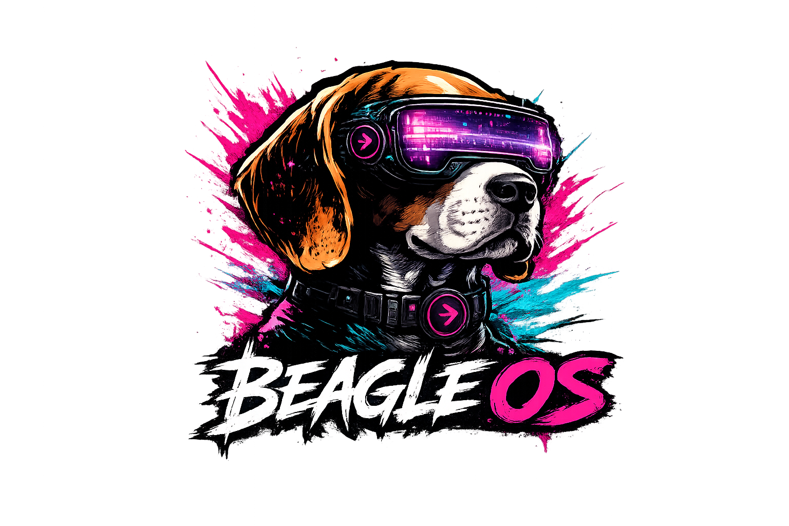

<div align="center">

[](https://beagle-os.com)

# Beagle OS

**Modern KVM/libvirt-based hypervisor, streaming platform & gaming kiosk**

[](LICENSE)
[](VERSION)
[]()
[]()
[]()

[🌐 Website](https://beagle-os.com) • [📥 Download](https://beagle-os.com/download/) • [📖 Docs](docs/) • [🐛 Issues](https://github.com/meinzeug/beagle-os/issues)

</div>

---

## 🚀 What is Beagle OS?

**Beagle OS** is a standalone, source-available **KVM/libvirt-based virtualization platform** designed for:
- 💻 **Thin-client endpoints** — Stream desktops via BeagleStream
- 🎮 **Gaming kiosks** — GeForce NOW & cloud gaming
- 🖥️ **Enterprise hypervisor** — Self-contained bare-metal stack
- 🚀 **Fleet management** — Reproducible, automated deployments

Free for private use. Commercial deployments require a license — [visit beagle-os.com](https://beagle-os.com) for details.

---

## ✨ Core Features

| Feature | Status | Details |
|---------|--------|---------|
| **KVM/libvirt Hypervisor** | ✅ Stable | Native bare-metal virtualization, no third-party deps |
| **BeagleStream E2E** | ✅ Stable | End-to-end streamed desktops & gaming |
| **Two-host clustering** | ✅ Stable | Distributed storage & failover |
| **WireGuard VPN** | ✅ Stable | Encrypted thin-client tunneling |
| **Backup/Restore** | ✅ Stable | Automated VM snapshots & recovery |
| **Gaming Kiosk** | ✅ Stable | GeForce NOW integrated shell |
| **USB provisioning** | ✅ Stable | Live-boot & installer artifacts |
| **Fleet provisioning** | ✅ In Progress | Auto-enrollment & group policies |

---

## 🎯 Three Deployment Modes

### 💻 **Beagle OS Desktop**
Lightweight endpoint for thin-client environments.
- Runs Beagle Stream Client
- Connects to any Beagle Stream Server VM
- Minimal footprint, max performance
- **Supports**: USB live-boot, VM-provisioned installers

### 🎮 **Beagle OS Gaming**
Dedicated gaming kiosk with GeForce NOW integration.
- Electron-based Electron shell
- Game library & catalog management
- Seamless launcher switching
- **Perfect for**: Gaming lounges, kiosks, casual cloud gaming

### 🖥️ **Beagle OS Server**
Full hypervisor on bare metal.
- Own KVM/libvirt stack (default)
- Optional Beagle host provider overlay
- Manage VMs, storage, networking
- **Includes**: Web console, API, clustering support

---

## 📂 Repository Structure

```
beagle-os/
├── beagle-host/              Control plane, API, provisioning
├── beagle-kiosk/             Electron gaming kiosk app
├── thin-client-assistant/    Endpoint runtime & live-build configs
├── core/                     Shared services & contracts
├── providers/
│   └── beagle/               Native KVM/libvirt provider
├── website/                  beagle-os.com Web UI
├── scripts/                  Build, deploy, validation utilities
├── docs/
│   ├── lasthope/             Product roadmap & release gates
│   ├── refactor/             Architecture & modernization plan
│   ├── checklists/           Release & validation checklists
│   └── deployment/           Host setup & runbooks
└── tests/                    Unit & integration test suite
```

---

## 🎮 Gaming Kiosk

The **beagle-kiosk** Electron app is now open-source and built into this repo.

**Key highlights:**
- ✅ GeForce NOW launcher integration
- ✅ Game library catalog refresh (daily + manual)
- ✅ Meine Bibliothek & Spielekatalog support
- ✅ Direct store links (affiliate-free)
- ✅ Built as AppImage for easy distribution
- ✅ Source in [`beagle-kiosk/`](beagle-kiosk/)

---

## 🚀 Quick Start

### 1️⃣ **Install on Existing Host**

```bash
git clone https://github.com/meinzeug/beagle-os.git
cd beagle-os
./scripts/setup-beagle-host.sh
./scripts/check-beagle-host.sh
```

**Result:** Full Beagle stack + Web Console on `http://localhost:9088`

### 2️⃣ **Boot New Server (Bare Metal)**

1. Download **Server Installer ISO** from [beagle-os.com/download](https://beagle-os.com/download/)
2. Boot target machine from USB/PXE
3. Enter hostname, credentials, target disk
4. Automated: Debian → Beagle Stack → First Boot Ready ✅

### 3️⃣ **Deploy Thin Clients**

**Option A:** USB Live-Boot Helper
```bash
curl -fsSL https://srv1.beagle-os.com/beagle-downloads/pve-thin-client-live-usb-vm-100.sh | bash
```

**Option B:** VM-specific USB Installer (Beagle Web Console)
- Navigate to **VM** → **Downloads** → **USB Installer**
- Download `pve-thin-client-live-usb-vm-100.sh`
- Run on target machine

**Option C:** Public ISO
- Download from [beagle-os.com/download](https://beagle-os.com/download/)
- Boot & install

---

## 📡 Architecture & Stack

### Layered Design

```
┌─────────────────────────────────────┐
│   Beagle Web Console + API (9088)   │
├─────────────────────────────────────┤
│  Beagle Host Control Plane          │
│  (provisioning, inventory, secrets) │
├─────────────────────────────────────┤
│  Provider Interface (contracts)     │
├─────────────────────────────────────┤
│  KVM/libvirt (Beagle Provider)      │  ← Native, no Proxmox
├─────────────────────────────────────┤
│  Linux Kernel + systemd             │
├─────────────────────────────────────┤
│  Bare Metal Hardware                │
└─────────────────────────────────────┘
```

### Key Services

| Service | Port | Purpose |
|---------|------|---------|
| **Web Console** | 9088 | VM management, provisioning |
| **Beagle API** | 9088 (unified) | REST API for fleet ops |
| **libvirt** | 16509 | KVM hypervisor socket |
| **WireGuard** | 51820 | Thin-client VPN |
| **Download Cache** | 80/443 | ISO, payload, updates |

---

## 🔧 Development & Build

### Prerequisites

- Linux host (Ubuntu 22.04 LTS or Debian 12+)
- 8+ GB RAM, 50+ GB disk
- git, Python 3.10+, libvirt-dev, build-essential

### Build Artifacts

```bash
# Build thin-client ISO + payload
./scripts/build-thin-client-installer.sh

# Build server installer ISO
./scripts/build-server-installer.sh

# Generate download artifacts
./scripts/prepare-host-downloads.sh

pytest tests/unit/test_thin_client_live_build_regressions.py
```

### Testing

```bash
# Quick unit tests
pytest -xvs tests/unit/

# Integration tests (requires VM runtime)
pytest -xvs tests/integration/

# Type checking
mypy core/ --strict --ignore-missing-imports
```

---

## 🌍 Operational Workflows

### 💻 Desktop Streaming Setup

1. **Install Host** — Boot server with Beagle installer ISO → Select *Standalone* mode
2. **Create Stream VM** — Web Console → New VM → Enable Beagle Stream Server
3. **Get Endpoint Installer** — Web Console → VM → Downloads → Copy USB installer URL
4. **Boot Endpoint** — USB stick → Select *Desktop* mode → Auto-connects to stream
5. ✅ **Live** — Beagle Stream Client connects and displays desktop

### 🎮 Gaming Kiosk Setup

1. **Boot Endpoint** → Select *Gaming* mode
2. **Kiosk Auto-Launches** → Game library loads
3. **Select Game** → GeForce NOW launches
4. **Exit GFN** → Auto-returns to kiosk

### 📦 Fleet Provisioning

```bash
# Automated VM provisioning via Beagle API
curl -X POST http://localhost:9088/api/v1/vms \
  -H "X-Beagle-Api-Token: $TOKEN" \
  -d '{"name":"vm-001","memory":2048,"vcpu":2}'

# Get VM-specific USB installer
curl http://localhost:9088/api/v1/vms/100/live-usb.sh > usb-vm-100.sh
```

---

## 📦 Public Release Artifacts

All stable releases are published to **[beagle-os.com/beagle-updates/](https://beagle-os.com/beagle-updates/)**

### Available Files

| File | Purpose | Updated |
|------|---------|---------|
| `beagle-downloads-status.json` | Current release metadata | Per release |
| `SHA256SUMS` | Artifact checksums | Per release |
| `beagle-os-installer-amd64.iso` | Bare-metal installer ISO | Per release |
| `beagle-os-server-installer-amd64.iso` | Server mode installer | Per release |
| `pve-thin-client-usb-payload-v*.tar.gz` | Endpoint runtime payload | Per release |
| `pve-thin-client-usb-bootstrap-v*.tar.gz` | Bootstrap disk image | Per release |
| `pve-thin-client-live-usb-vm-*.sh` | VM-specific USB helper | On demand |
| `BeagleStream-latest-x86_64.AppImage` | Kiosk app | Per release |

---

## 🏗️ Build & Release Pipeline

### Local Development Build

```bash
# One-time setup
make setup-dev

# Build all artifacts locally
make build
make test

# Validate before release
make validate-release
```

### CI/CD Release Flow

```
commit to main
  ↓
GitHub Actions: lint, test, build
  ↓
Create GitHub Release
  ↓
Publish to beagle-os.com
  ↓
Update live servers (srv1, srv2)
  ↓
Announce release
```

**Monitor:** [github.com/meinzeug/beagle-os/actions](https://github.com/meinzeug/beagle-os/actions)

---

## 📚 Documentation

| Doc | Purpose |
|-----|---------|
| [📖 docs/README.md](docs/README.md) | Full documentation index |
| [🗺️ docs/lasthope/](docs/lasthope/) | Product roadmap & release gates |
| [🔨 docs/refactor/](docs/refactor/) | Architecture & modernization plan |
| [✅ docs/checklists/](docs/checklists/) | Release & validation checklists |
| [🚀 docs/deployment/](docs/deployment/) | Host setup & runbooks |

---

## 📜 License

Beagle OS is licensed under the **[Beagle OS Source Available License](LICENSE)**.

- ✅ **Private use** — Free, no restrictions
- 🏢 **Commercial use** — Requires license agreement
- 📧 **Request commercial license** — [contact@beagle-os.com](mailto:contact@beagle-os.com) or [beagle-os.com](https://beagle-os.com)

---

## 🤝 Contributing

We welcome contributions! Please see [CONTRIBUTING.md](docs/contributing.md) for:
- Code style & linting rules
- Pull request process
- Testing requirements
- Security reporting guidelines

---

## 💬 Community & Support

- **Website** — [beagle-os.com](https://beagle-os.com)
- **Issues** — [GitHub Issues](https://github.com/meinzeug/beagle-os/issues)
- **Discussions** — [GitHub Discussions](https://github.com/meinzeug/beagle-os/discussions)
- **Security** — See [SECURITY.md](SECURITY.md)

---

<div align="center">

**Built with ❤️ for streaming, gaming, and enterprise virtualization**

[⬆ Back to Top](#-beagle-os)

</div>
